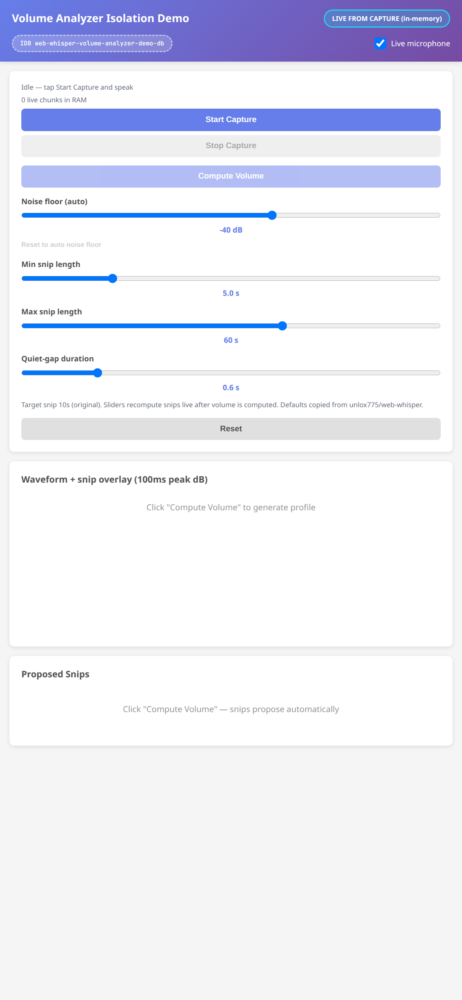
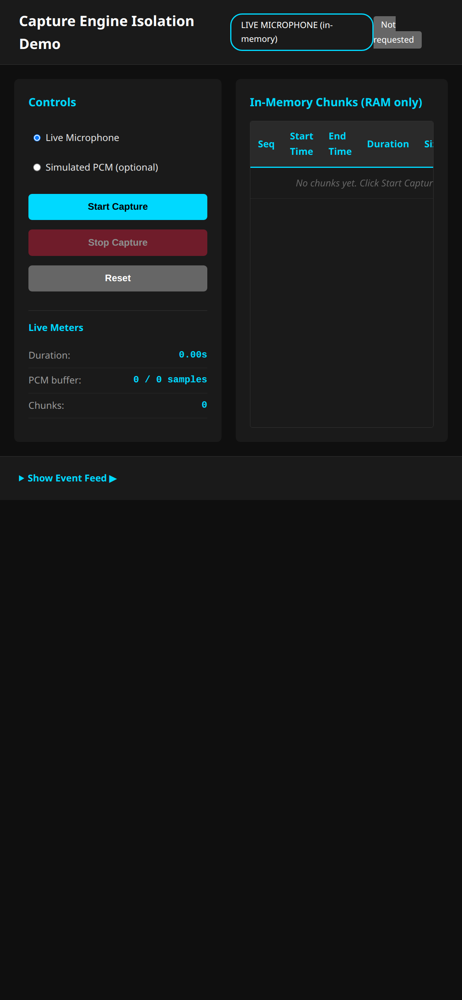

Spec Status: resolved
Spec Type: feedback
Created: 2026-08-28T21:03:00Z
Resolved: 2026-08-28T23:35:00Z
Product: apps/web-whisper-pwa

# Feedback: Isolation Demos Live Mic Capture + Compact Mobile Type

## User Feedback (Dave, 2026-08-28)

Simulated/dummy-only isolation demos are not useful. He needs to record his own audio in those demos. Bring in capture (and other packages as needed) so demos are functional with live recording.

Also: on iPhone/mobile, cut font size roughly in half (and padding) — tiny text is fine; he uses them on phone, even landscape. Desktop can stay normal-ish. Detect mobile vs desktop.

## Requested Outcome

- For volume-analyzer, playback, transcription, session-store demos (and capture): primary path is live mic via capture-engine where it makes sense; fixtures can remain as optional secondary.
- Capture demo already in-memory — keep that. Wire it to the real capture-engine (not a mock that only probes permission then emits silent blobs).
- Other demos should accept live audio from capture without writing to PWA `web-whisper-db`.
- Isolation still means separate IndexedDB namespaces from the PWA — but demos MAY depend on the capture-engine package for live mic.
- CSS: `@media` mobile / coarse pointer / max-width ~480px → ~50% font-size and tighter padding (or transform: scale). Desktop unchanged enough to be readable in a large window.
- Keep `docs/isolation-demos` publish via `make build`.
- Draft PR. iPhone 1170×2532 shots: (1) a demo with live-record control visible (not fixture-only), (2) mobile tiny typography. `documentation/qa/` + PR body. Do not merge.

## Out of Scope

- PWA session-detail copy UX
- Snip algorithm defaults
- Recording overlay Stop layout
- `node_modules`

## Storage Isolation Contract (unchanged namespaces)

GitHub Pages is same-origin, so path is not isolation. Each surface must use a distinct IndexedDB name / localStorage key prefix. Live capture in demos is in-memory (or sandbox session-store) and must never open `web-whisper-db`.

| Surface | Persistence | Namespace |
|---|---|---|
| PWA | IndexedDB + localStorage | IndexedDB `web-whisper-db`; keys `groq_api_key`, `developer_mode_enabled`, … |
| capture-engine demo | In-memory only (live or simulated PCM) | Reserved `web-whisper-isolation-demo-capture-engine` (unused; no IDB / localStorage writes) |
| playback-engine demo | Live chunks in RAM; optional fixture blobs | Reserved `web-whisper-isolation-demo-playback-engine` (unused; no IDB writes) |
| volume-analyzer demo | Live/fixture chunks in RAM; tuner settings in isolated IndexedDB | IndexedDB `web-whisper-volume-analyzer-demo-db` |
| transcription-client demo | Live/fixture audio in RAM; API key stays in the input | Reserved prefix `ww-iso-transcription-client:` (not written to PWA keys) |
| session-store demo | Sandbox IndexedDB; live capture flushed into this sandbox only | IndexedDB `web-whisper-isolation-demo-session-store`; sessionStorage `ww-iso-session-store:*` |

No demo opens `web-whisper-db`. Capture remains in-memory. Volume-analyzer, playback, and transcription do not share capture-demo storage. Session-store live capture writes only to the sandbox DB.

## Implementation Notes

- Isolation demos may import `@web-whisper/capture-engine` (`startCapture` with `{ audioSource: 'live', inMemory: true }`).
- Fixtures stay available as a secondary control (radio, checkbox, or data-source dropdown).
- Compact mobile CSS applies on `(max-width: 480px)` or `(hover: none) and (pointer: coarse)` so iPhone landscape is included. Desktop fine-pointer / wide windows stay full size.
- `make build` continues to publish `docs/isolation-demos/`.

## QA Shots Required (1170×2532, `documentation/qa/`)

- [x] `isolation-demos-live-record-control.png` — Volume Analyzer with live-record Start Capture visible
- [x] `isolation-demos-mobile-tiny-type.png` — Capture Engine at iPhone viewport (`zoom: 0.5`)

## Resolution Criteria

Mark resolved when:

- [x] Capture, volume-analyzer, playback, transcription, and session-store isolation demos expose a live-mic record path via capture-engine
- [x] Fixtures remain optional secondary where they already existed
- [x] No demo writes to `web-whisper-db`
- [x] Mobile/coarse-pointer CSS halves type and padding; desktop stays readable
- [x] `make build` publishes `docs/isolation-demos/`
- [x] iPhone 1170×2532 shots in `documentation/qa/` and PR body
- [x] Session-detail copy UX and snip defaults untouched
- [x] PR kept draft

## Resolution

Shipped on branch `cursor/isolation-demos-live-capture-5297`.

### What changed

- Capture isolation demo uses real `@web-whisper/capture-engine` (`inMemory: true`); Live Microphone is the default source.
- Volume Analyzer, Playback, Transcription, and Session Store demos accept live mic audio via capture-engine; fixtures remain optional secondary.
- Playback adds `playBlobs()` for RAM chunks without opening session-store.
- Session Store live capture flushes chunks into `web-whisper-isolation-demo-session-store` only.
- Shared compact mobile CSS: `@media (max-width: 480px), ((hover: none) and (pointer: coarse)) { html { zoom: 0.5 } }`.
- Deploy script aliases capture-engine + lamejs for `docs/isolation-demos/` publish.

### Proof shots (1170×2532)

### Verification

- Interactive iPhone viewport pass across all five demos: live Start Capture controls visible; fixtures secondary.
- `make build` publishes PWA + `docs/isolation-demos/`.
- `DEFAULT_SNIP_OPTIONS` unit tests still pass.
- Session-detail copy UX and snip defaults untouched.
