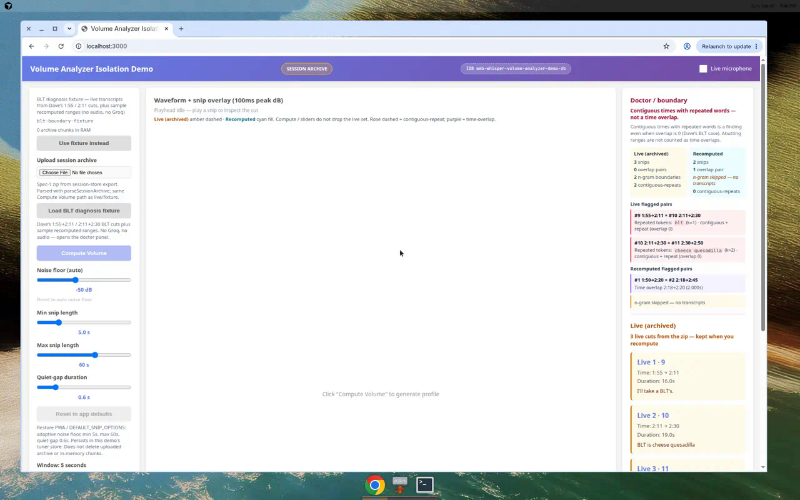

Spec Status: resolved
Spec Type: feedback
Created: 2026-09-06T20:46:02Z
Resolved: 2026-09-06T21:50:00Z
Product: packages/lib/volume-analyzer

# Feedback: Isolation Demo — snip overlap + boundary-repeat detection

## User Feedback

Dave’s live Debug UI on `ses_1788550979475_nxkjk4yv` (~3m27s) shows **contiguous** snip times with **repeated boundary words**:

| Snip | Range | Transcript (boundary) |
| --- | --- | --- |
| #9 | 1:55→2:11 | ends “BLT's.” |
| #10 | 2:11→2:30 | starts “BLT is cheese quesadilla” |
| #11 | continues | “cheese quesadillas” |

Timestamps **abut** (`end(N) === start(N+1)`). Time-overlap is **zero**. Words still repeat. Possible causes (do not “fix” yet): edge hangover audio in both clips, ASR bleed, or live incremental proposal ≠ full-session recompute.

He needs **diagnosis tooling** that flags:

1. Actual **time overlaps** between snip ranges
2. **Adjacent transcript n-gram repeats** at boundaries
3. A **live (archived) vs recomputed** comparison when both sets exist

There is **no** `packages/*/doctor` package. PWA Session Detail Debug has `apps/web-whisper-pwa/src/doctor.ts` (`runDoctor`): coverage gaps, missing blobs, decode failures, and a `snipScan` that only checks out-of-range / `end <= start`. It does **not** detect overlaps or transcript repeats.

Keep the new checks in the **volume-analyzer Isolation Demo** (plus a small shared helper). Optionally feed the same helper into PWA `snipScan` — Isolation Demo is sufficient to resolve this spec.

## Depends on

- Spec A (`20260906204600`) — recomputes should be runnable at app defaults so the comparison is meaningful.
- Spec B (`20260906204601`) — archived live snips + transcripts in the zip. If B is not on the branch, still detect overlaps / n-grams on **recomputed** snips and on any demo-local transcript text; skip the live-vs-recompute panel until archived snips exist.

Implement **B before C** if C’s comparison panel needs archived snips.

## Requested Outcome

Diagnosis surface only. Do **not** change `proposeSnipsFromProfile` / `src/snips.ts` / defaults.

### 1. Shared helper (preferred: volume-analyzer)

Add a small, tested helper (library `src/` **or** Isolation Demo `src/` if you want zero PWA coupling). If PWA doctor will call it, put it in `packages/lib/volume-analyzer/src/` and export it. Do **not** create a new package.

Inputs: a list of snips `{ startTime, endTime, id? }` plus optional transcript strings aligned in the same order (or `{ snipId, text }`).

**Time overlap**

- Two snips overlap when `startA < endB && startB < endA` and the intersection length is **> ε** (e.g. 1 ms).
- **Abutting** ranges (`endA === startB` or `|endA − startB| ≤ ε`) are **not** overlaps.
- Report each overlapping pair: indices/ids, both ranges, overlap `[from, to]`, duration.

**Adjacent transcript n-gram repeats** (when text exists)

- Consider consecutive snips only (sorted by `startTime`).
- Tokenize simply: lowercase, strip wrapping punctuation. Treat `BLT's` / `blt` as a match if you normalize possessives / trailing `'` / `'s` (document the rule).
- Flag when the last **k** tokens of snip N ≈ the first **k** tokens of snip N+1 for any **k ∈ {1, 2, 3}**.
- Dave’s case: last token of #9 (`blt's` → `blt`) equals first token of #10 (`blt`). That is a **k=1** hit. “cheese quesadilla(s)” between #10/#11 is a **k=2** (or fuzzy suffix) hit — document whether you stem a trailing `s`.
- If a snip has no text, skip the n-gram check for that boundary; still run time-overlap.

**Contiguous + repeat is a finding**

Call this out in the UI and in helper metadata, e.g. `contiguousBoundaryRepeat`:

- `overlapDuration === 0` (or abutting)
- **and** an n-gram repeat

Copy must not say “no issues” just because overlap count is 0. Headline something like: **Contiguous times with repeated words — not a time overlap.**

### 2. Isolation Demo UI

On the volume-analyzer Isolation Demo, after snips exist:

- A **Doctor / boundary** panel (sidebar or under Proposed Snips). Not a hidden console dump.
- Counts: snip N, overlap pairs, n-gram boundary hits, contiguous-repeat hits.
- List flagged pairs with times + the repeated tokens.
- When **both** live (archived) snips and recomputed snips exist (Spec B):
  - Side-by-side and/or histogram overlay: live vs recomputed (count, ranges, which boundaries are flagged on each set).
  - Distinct marker styles (already required to keep live vs recomputed distinguishable).
- When only recomputed snips exist: still run overlap + n-gram on that set (n-gram only if the demo has text — archived transcripts or a later demo transcription; if no text, say **n-gram skipped — no transcripts**).

Do not require Groq / transcription-client to resolve this spec. Archived transcripts from Spec B are enough for Dave’s BLT session.

### 3. Optional PWA doctor

If cheap: extend `apps/web-whisper-pwa/src/doctor.ts` `snipScan` with overlap + n-gram (join `getTranscriptsForSession`). Same helper. Isolation Demo alone is enough to mark this spec resolved.

## Tests

Pure helper tests (no browser required):

- Overlap pair (`[0, 10]` vs `[8, 15]`)
- Abutting pair (`[115, 131]` vs `[131, 150]`) → **no** overlap, **yes** contiguous
- Invalid / empty lists
- N-gram: “BLT's.” / “BLT is cheese quesadilla” → k=1 hit
- N-gram: “…cheese quesadilla” / “cheese quesadillas…” → document expected k
- Missing transcripts → n-gram skipped, overlaps still reported
- Contiguous + n-gram → `contiguousBoundaryRepeat` (or equivalent) true

## Notes For Phase 07

- Cursor Cloud Agent only — never Codex.
- Isolation Demo + helper; PWA doctor optional.
- Do **not** change the snip algorithm.
- `make build` so `docs/isolation-demos/volume-analyzer/` publishes. If PWA doctor changes, refresh `docs/` PWA artifacts too.
- Screenshot: doctor panel showing a contiguous boundary-repeat (BLT fixture or a unit-constructed list).
- Update this spec with a Resolution section when implementation ships.
- Do **not** mark this spec resolved from a specs-only commit.

## Out of scope

- Changing hangover / `proposeSnipsFromProfile` / incremental vs full-session proposal
- Spec A slider reset and Spec B export format (consume them; do not redo)
- A new doctor package
- Requiring live Groq transcription in the Isolation Demo

## Resolution Criteria

Mark this spec resolved when:

- [x] Time overlaps between snip `start`/`end` ranges are detected and listed
- [x] Adjacent 1–3 token transcript repeats are detected when text exists
- [x] Contiguous times + repeated words is a first-class finding even when overlap is zero
- [x] Live (archived) vs recomputed side-by-side / overlay exists when both sets are loaded
- [x] Helper is unit-tested (overlap, abut, BLT-style n-gram)
- [x] `proposeSnipsFromProfile` / defaults unchanged
- [x] `make build` published Isolation Demo (and PWA if doctor.ts changed)
- [x] Spec updated with a Resolution section documenting what shipped

## Resolution

**Resolved**: 2026-09-06  
**Package**: `packages/lib/volume-analyzer` Isolation Demo + shared helper; optional PWA `snipScan` reuse  
**Algorithm**: unchanged — `src/snips.ts` / `proposeSnipsFromProfile` / `DEFAULT_SNIP_OPTIONS` were not edited. No new doctor package.

### What landed

- Shared helper `src/boundaryScan.ts` (`scanSnipBoundaries`), exported from the library:
  - **Time overlap**: intersection length **> 1 ms** (`OVERLAP_EPSILON_SECONDS`). Abutting (`|endA − startB| ≤ ε`) is **not** an overlap.
  - **Adjacent n-gram**: last 1–3 tokens of N ≈ first 1–3 of N+1. Tokenize: lowercase, strip wrapping punctuation, strip possessive `'s` / trailing `'`. Comparison stems one trailing `s` (not `ss`) on tokens longer than 3 chars so `quesadilla` ≈ `quesadillas` (**k=2**). `BLT's.` → `blt` equals first token of `BLT is…` (**k=1**).
  - **`contiguousBoundaryRepeat`**: abutting (overlap duration 0) **and** an n-gram hit. Missing / empty transcripts skip n-gram for that boundary (or all boundaries) and still report overlaps.
- Isolation Demo **Doctor / boundary** panel (right column, above Live / Proposed Snips): snip / overlap / n-gram / contiguous-repeat counts; flagged pairs with clocks + repeated tokens. Headline copy: **Contiguous times with repeated words — not a time overlap.** Overlap count 0 is not “no issues.”
- When both live (archived) and recomputed sets exist: side-by-side counts + separate flagged-pair lists; histogram overlay keeps amber-dashed live vs cyan recomputed, plus rose (contiguous) / purple (overlap) ticks.
- No transcripts → explicit **n-gram skipped — no transcripts**.
- **Load BLT diagnosis fixture** (no Groq, no audio) loads Dave’s `1:55→2:11` / `2:11→2:30` live cuts plus a sample overlapping recomputed pair so the comparison is visible without a zip.
- Optional: PWA `apps/web-whisper-pwa/src/doctor.ts` `snipScan` joins `getTranscriptsForSession` and appends `formatBoundaryScanIssues`.

### Doctor panel (BLT fixture)

Live: 3 snips, **0 overlaps**, 2 n-gram / 2 contiguous-repeats (`blt` k=1, `cheese quesadilla` k=2).  
Recomputed: 2 snips, **1 overlap** (2.000s), **n-gram skipped — no transcripts**.

### How to repro

1. Open the Isolation Demo (`docs/isolation-demos/volume-analyzer/` on Pages, or isolation-demo Vite).
2. Click **Load BLT diagnosis fixture**. The doctor panel should show the headline, live vs recomputed counts, BLT contiguous-repeat pairs, and recomputed overlap + n-gram skipped.
3. Or upload a Spec B debug zip (live snips + transcripts), then **Compute Volume**: doctor runs on both sets.
4. Fixture-only **Compute Volume**: doctor still runs; n-gram skipped because the demo has no transcripts.

### Tests / publish

- `src/boundaryScan.test.ts` — overlap `[0,10]`/`[8,15]`; abut `[115,131]`/`[131,150]` no overlap; BLT n-gram; quesadilla k=2; missing transcripts; `contiguousBoundaryRepeat`.
- `make build` published `docs/isolation-demos/volume-analyzer/` and PWA `docs/` (doctor.ts changed).
