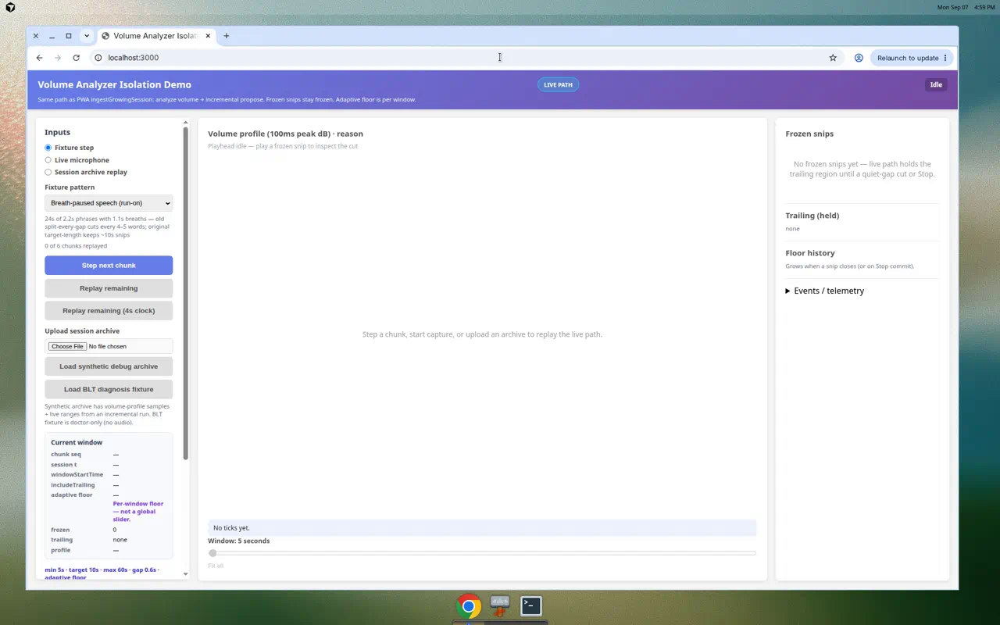
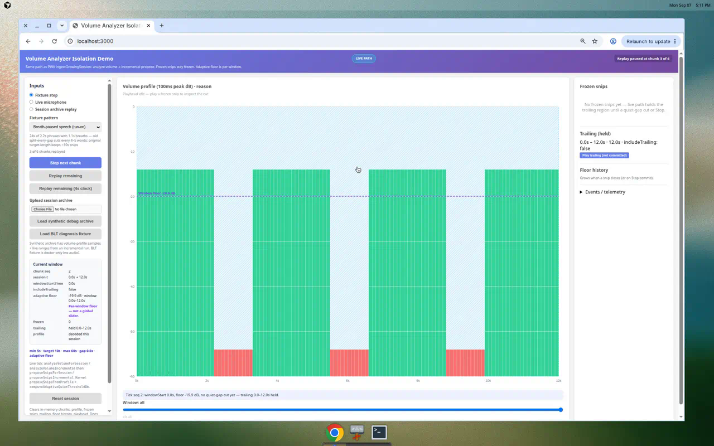
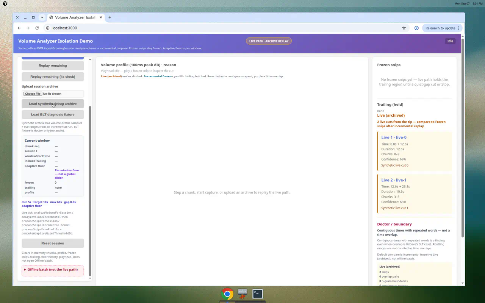
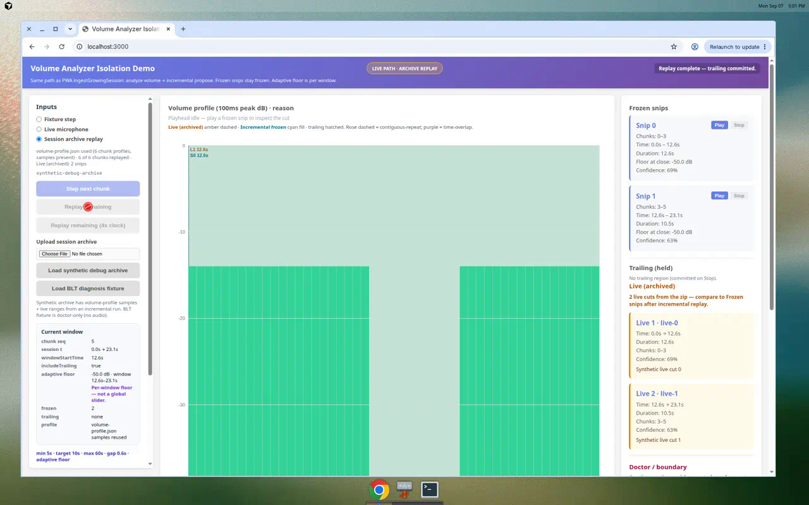
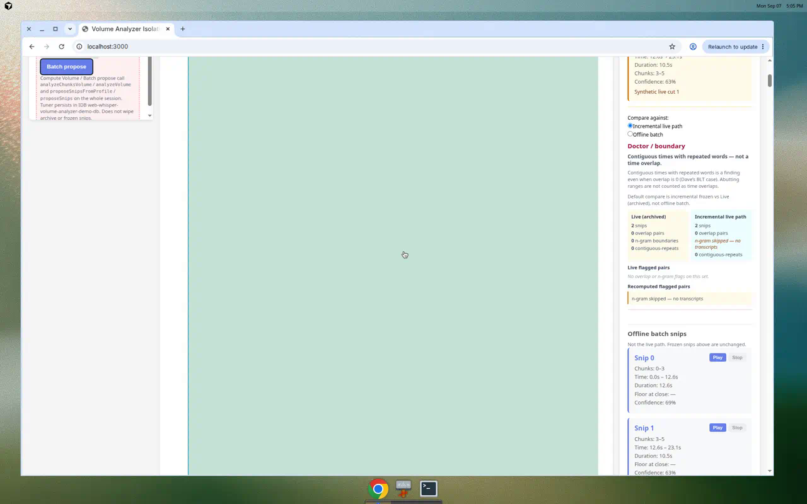
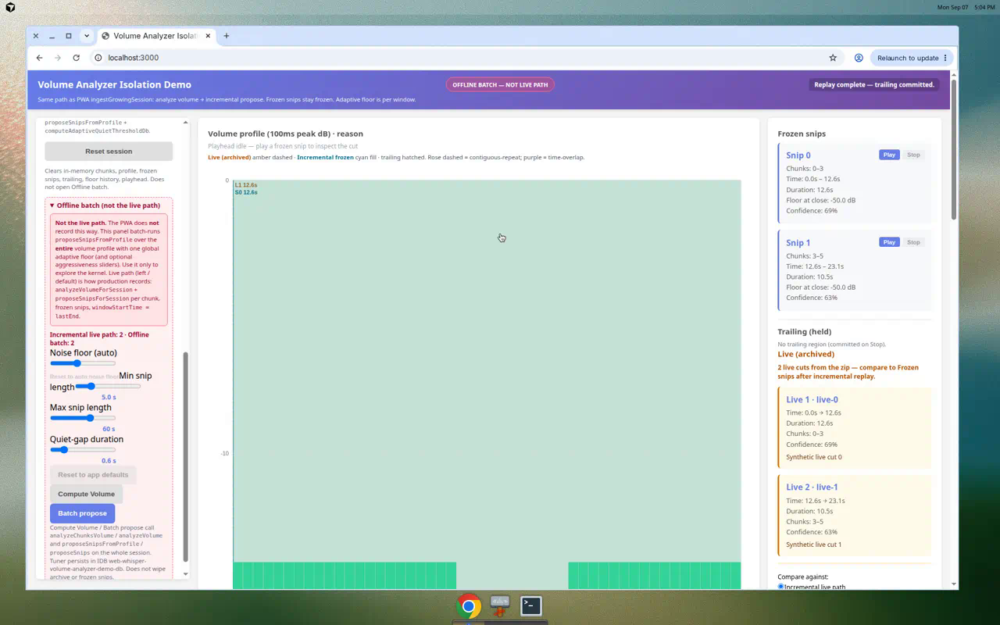

Spec Status: resolved
Spec Type: feedback
Created: 2026-09-07T16:30:00Z
Product: packages/lib/volume-analyzer

# Feedback: Isolation Demo redesign — live package path

## User Feedback

Dave confirmed the current volume-analyzer Isolation Demo is **misleading**. It batch-runs `proposeSnipsFromProfile` over the **whole session** (one global adaptive floor + tuner sliders) while production PWA uses package APIs `analyzeVolumeForSession` + `proposeSnipsForSession` **incrementally**:

- Freeze already-saved snips.
- `windowStartTime = lastEnd` (audio after the last frozen snip only).
- Adaptive floor is computed on **that window**, not the whole take.
- The PWA fires this path as `chunkEncoded` arrives (~4s chunks) via `ingestGrowingSession`:
  - while recording: `{ includeTrailing: false }`
  - on Stop / end: `{ includeTrailing: true }`

Archive upload of real 4s chunks therefore **cannot replay live cuts**. Dave’s BLT debug session is the motivating case (live vs batch counts diverged — **13 vs 11**). He wants a **significant Isolation Demo redesign** so the demo operates the package the way production does, covering the package’s real surfaces.

This spec is **Phase-1 concrete** (panels, chrome, controls, before/after). It is the work order for a later implementation PR. **Do not implement the redesign UI in the same commit as this spec.**

## Current behavior (do not treat as the live path)

Isolation Demo `isolation-demo/src/App.tsx` today:

- Collects all chunks (live mic until Stop, fixture generate-all, or archive upload-all).
- **Compute Volume** calls `analyzeChunksVolume(chunks)` then `proposeSnipsFromProfile(profiles, metadata, sliderOptions)` once over the full profile.
- One `computeAdaptiveQuietThresholdDb(allSamples)` for the whole session.
- Leading chrome is tuner sliders (noise floor / min / max / quiet-gap) that recompute the full session.
- Archive overlay + boundary doctor exist and **must be kept**, but they currently compare **live archived** vs **offline batch**, not vs incremental replay.

That batch path is still useful as a labeled advanced tool. It must not remain the headline or the default action.

## Production path to mirror

PWA `apps/web-whisper-pwa/src/orchestration.ts` `ingestGrowingSession`:

1. `analyzeVolumeForSession(sessionId)` — decode **new** chunks only; merge into stored volume profile.
2. `proposeSnipsForSession(sessionId, { includeTrailing })` — freeze persisted snips; `windowStartTime = lastEnd`; write only new closed snips.

Package internals (`src/session.ts`, `src/snips.ts`):

- `proposeSnipsFromProfile(..., { windowStartTime, includeTrailing })` already implements the window + trailing hold.
- Adaptive floor (`computeAdaptiveQuietThresholdDb`) runs on the **window samples** when `quietThreshold` is omitted (`DEFAULT_SNIP_OPTIONS`).
- Dedup / skip: snips whose `startTime` is already stored (`SNIP_START_EPSILON = 0.05s`) or that start before `lastEnd`.

The Isolation Demo must exercise **this** logical path. Slider-driven full-session propose is secondary.

## Requested Outcome

Redesign the package-local Isolation Demo so a founder can operate volume-analyzer the way the PWA records, see hidden decisions (floors, windows, frozen snips), and replay a debug zip chunk-by-chunk.

Visual contract after this spec merges: `packages/lib/volume-analyzer/isolation-demo/README.md`. Implement against that README + this spec. Old batch-first README / customer-doc walkthroughs are **not** the UI source of truth.

### How the demo calls the package (prefer real exports)

The demo may stay in-memory (no `web-whisper-db`). Choose **one** of these, in preference order, and document the choice in the Resolution:

1. **Preferred — call the session APIs** (`analyzeVolumeForSession` / `proposeSnipsForSession`) against an **in-demo session-store sandbox / memory adapter** that implements the store surface those functions already use (`getSession`, `getChunksForSession`, `getChunk`, `getVolumeProfile`, `writeVolumeProfile`, `getSnipsForSession`, `writeSnip`). Sandbox must **not** open `web-whisper-db`. A dedicated demo DB name (or pure RAM adapter injected into `session.ts`) is allowed. If `session.ts` currently hard-imports session-store, a **narrow** optional store injection is in scope; do **not** change cut math.

2. **Allowed — extract/share a pure incremental helper** that `proposeSnipsForSession` / `analyzeVolumeForSession` also call. Suggested shapes (names may vary; planning contracts):

   ```ts
   analyzeVolumeIncremental(existingProfiles, newChunks) → mergedProfiles

   proposeSnipsIncremental(volumeProfile, chunks, frozenSnips, options) → {
     frozen: Snip[];          // previously frozen, unchanged
     newlyClosed: Snip[];     // written / committed this tick
     trailing: Snip | null;   // in-progress region held back when includeTrailing:false
     windowStartTime: number; // lastEnd going in
     adaptiveFloorDb: number | null; // floor used for this window (omit if quietThreshold override)
   }
   ```

   Production still uses `analyzeVolumeForSession` / `proposeSnipsForSession` as the PWA API. The demo calls the shared helper (or the session APIs). **Do not** reimplement freeze + `windowStartTime` as a one-off inside `App.tsx`.

3. **Not allowed:** Demo-only `proposeSnipsFromProfile(fullProfile)` as the primary live action.

Standalone wrappers `analyzeVolume(chunks)` / `proposeSnips(chunks, profile, options)` remain public and must stay visible (see checklist). They are **not** the live recording path.

---

## A. Primary mode — Live package path (default)

This is the factory floor. Default on page load. **Do not** lead with a global noise-floor slider as if it were the live path.

### Runtime / viewport / data mode

| Item | Contract |
| --- | --- |
| Runtime | Web app (package-local Vite / `npm start`) |
| Viewport | Desktop browser, factory floor (not phone-shaped). Three columns: inputs left, profile/reason center, outputs right. |
| Orientation | Landscape / wide split. Fixed header chrome. |
| Inputs | Live mic (capture-engine, in-memory), fixture chunks stepped as if `chunkEncoded` fired, uploaded session-archive chunks stepped the same way. |
| Data mode | **Live package path** is the operating mode. Data *source* is a labeled switch: Live mic / Fixture step / Archive replay. |
| Safe default | **Fixture step-through** on the live path (no mic permission). First fixture remains “Breath-paused speech (run-on)” so a founder can click Step three times without a zip. Archive replay is for a real failed take. |

### Top chrome (full width, always visible)

- **Left:** heading `Volume Analyzer Isolation Demo` (bold).
- **Center:** path chip (one of):
  - `LIVE PATH` (cyan) — fixture step or idle live mic, incremental propose.
  - `LIVE PATH · MIC` (cyan) — capture running or captured via mic.
  - `LIVE PATH · ARCHIVE REPLAY` (amber) — debug/slim zip loaded; chunks queued for incremental replay.
  - `OFFLINE BATCH — NOT LIVE PATH` (rose / warning) — **only** when the advanced disclosure is open **and** the operator has run a full-session propose. Never the load default.
- **Right:** recording / replay state: `Idle` / `Recording (includeTrailing: false)` / `Stopped (trailing committed)` / `Replay paused at chunk N of M`.
- **Subline (always):** `Same path as PWA ingestGrowingSession: analyze volume → incremental propose. Frozen snips stay frozen. Adaptive floor is per window.`

No noise-floor slider in the chrome.

### Left panel — Inputs / live controls

**Heading:** `Inputs`

**Source radios** (exactly one):

1. `Fixture step` (default)
2. `Live microphone`
3. `Session archive replay`

**Fixture step (default source)**

- Pattern dropdown (existing patterns; default Breath-paused speech). Changing pattern **resets** the in-memory session (chunks, profile, frozen snips, floor history).
- Buttons:
  - `Step next chunk` (primary) — generate/append the next ~4s fixture chunk and run **one live tick**.
  - `Replay remaining` — step every remaining fixture chunk immediately (no 4s wall clock).
  - `Replay remaining (4s clock)` — optional; one tick per ~4s so growth is watchable.
- Disabled `Step` when no more fixture chunks.

**Live microphone**

- `Start capture` / `Stop capture` (existing capture-engine in-memory).
- On each `chunkEncoded`: run one live tick with `includeTrailing: false`.
- On `Stop`: one final tick with `includeTrailing: true`.
- Do **not** wait for a “Compute Volume” click. That button is not in this panel.

**Session archive replay**

- File input: `Upload session archive` (existing `parseSessionArchive`; no `web-whisper-db`).
- After parse: chunks become a **queue**, not a batch analyze.
- Status line (required):
  - `volume-profile.json used (N chunk profiles, samples present)` **or**
  - `volume-profile.json present but no per-chunk samples — decode fallback` **or**
  - `no volume-profile.json — decode fallback` **or**
  - existing parse errors (`Cannot read archive`, `Not a supported session archive`, `No audio in archive to analyze`).
- Prefer archived `volume-profile.json` **when `chunkVolumes[].samples` exist**. Map into `ChunkVolumeProfile` (same mapping `session.ts` `profilesFromStored` uses). Replay then **does not re-decode** those chunks for the live path.
- Fall back to `analyzeChunksVolume` / `analyzeVolume` decode per stepped chunk when samples are missing.
- Keep Live (archived) snips + transcripts in memory for overlay / doctor (existing Spec B mapping).
- Same Step / Replay remaining / 4s-clock controls as fixture, feeding archive chunks in `seq` order.
- Slim zip (`hasSnips: true` but no `snips.json`): keep the existing note `hasSnips is a flag only — live ranges were not exported`. Incremental replay still runs.

**Live-tick readouts (always, this panel — hidden decisions)**

A compact **Current window** card, updated after every tick:

| Label | What it shows |
| --- | --- |
| `chunk seq` | Last ingested seq (0-based) |
| `session t` | `0.0s → lastChunk.endTime` |
| `windowStartTime` | `lastEnd` of frozen snips, or `0` |
| `includeTrailing` | `false` (recording / mid-replay) or `true` (Stop / Replay finished) |
| `adaptive floor` | dB used **for this window** (e.g. `−47.2 dB · window 12.4s–16.4s`). Copy: `Per-window floor — not a global slider.` |
| `frozen` | Count of committed snips |
| `trailing` | `held` + time range, or `none` |

**Defaults on the live path**

- Options = `DEFAULT_SNIP_OPTIONS` (adaptive floor; min 5s; target 10s; max 60s; gap 0.6s).
- **No** leading noise-floor / min / max / quiet-gap sliders here.
- A small line of production defaults (read-only): `min 5s · target 10s · max 60s · gap 0.6s · adaptive floor`.
- `Reset session` (gray): clears in-memory chunks, profile, frozen snips, trailing, floor history, playhead. Does **not** open Offline batch. Distinct from `Reset to app defaults` (that control lives in Offline batch).

**Advanced disclosure (collapsed by default)**

- Summary: `Offline batch (not the live path)`
- Opening it does **not** change the path chip until the operator actually runs a batch propose.
- Contents: see section C.

### Center panel — Volume profile / reason

**Heading:** `Volume profile (100ms peak dB) · reason`

**Before any tick:** placeholder `Step a chunk, start capture, or upload an archive to replay the live path.`

**After ticks:**

- Histogram of the growing profile (existing canvas).
- **Frozen snips:** solid cyan bands / markers (committed).
- **Trailing / in-progress region:** hatched or dim band, labeled `Trailing (not committed)` while `includeTrailing: false`. Disappears or becomes a frozen band after Stop / final tick with `includeTrailing: true`.
- **Current-window adaptive floor:** horizontal dashed line drawn **across the current window only** (`windowStartTime` → current end), labeled with the dB value. Do not draw one global floor across the whole session as if that were the live rule. Optional faint ticks at historical floors on closed snips.
- **Live (archived)** overlay when archived snips exist: amber dashed (keep existing legend). Recomputed **incremental** markers stay cyan. Doctor rose/purple ticks stay.
- Keep **zoom / pan** (window slider + Fit all + horizontal scrollbar). Window slider is viewport, not snip algorithm.
- Keep **snip play / playhead** (session-relative `snip.startTime + currentTime`; pause freezes; stop/ended clears). Play works on frozen snips; playing trailing is optional and must say `trailing (not committed)` in the readout.

**Reason strip** (under the histogram, one or two sentences that change per tick):

Examples:

- `Tick seq 0: windowStart 0.0s, floor −51.0 dB, no quiet-gap cut yet — trailing 0.0–4.0s held.`
- `Tick seq 2: windowStart 0.0s, floor −48.4 dB, closed snip #0 0.0–11.2s (target reached + quiet center). New windowStart 11.2s.`
- `Stop: includeTrailing true — committed trailing 11.2–14.8s as snip #1.`
- `Archive replay used stored samples; floor history is from incremental windows, not a single session percentile.`

### Right panel — Outputs

**1. Frozen snips** (heading `Frozen snips` — not “Proposed Snips”)

- Same columns as today (id, chunks, start→end, duration) plus:
  - `floor` column: adaptive floor dB **at the tick that closed this snip** (from floor history). `—` if unknown.
- Play / Pause / Stop per row (keep).
- Empty state: `No frozen snips yet — live path holds the trailing region until a quiet-gap cut or Stop.`

**2. Trailing (held)**

- One row or a callout: range, duration, `includeTrailing: false`.
- Empty state after Stop: `No trailing region (committed on Stop).`

**3. Live (archived)** (keep `ArchivedSnipList` when zip/fixture has live ranges)

- Heading stays `Live (archived)`.
- Count line: `N live cuts from the zip — compare to Frozen snips after incremental replay.`
- Do not drop this set when stepping / recomputing.

**4. Doctor / boundary** (keep)

- Same panel: overlap, n-gram, contiguous-repeat headline.
- When both live archived and **incremental frozen** sets exist: side-by-side / overlay uses **incremental frozen** as the “recomputed” set (not the offline batch list).
- If the operator later runs Offline batch, doctor may show a third labeled column or a toggle: `Compare against: Incremental live path | Offline batch`. Default **Incremental live path**. Copy must say which set is which.

**5. Floor history**

- Table: `snip # | closed at t | windowStart | window samples | floor dB | includeTrailing`.
- Grows only when a snip **closes** (or on Stop commit).
- This is the hidden decision Isolation Demo must expose.

### Events and telemetry (secondary, but present)

A disclosure under outputs or under the histogram: `Events / telemetry` (collapsed is OK; must exist).

**Event feed** (what another package could subscribe to / what PWA relies on):

- `chunkEncoded` (seq, start, end)
- `volumeUpdated` (chunkCount, sampleCount, newChunksDecoded | profileReused)
- `snipsProposed` (windowStartTime, includeTrailing, newlyClosedCount, trailingHeld)
- `snipFrozen` (snipId, start, end, floorDb)
- `trailingCommitted` (on Stop)
- `replayComplete`

**Telemetry** (why):

- Per tick: duration of analyze + propose, adaptive floor dB, `windowStartTime`, sample count in window, whether archived profile was reused, errors (`no_chunks`, `chunk_decode_failed`, `volume_profile_missing`).

---

## B. Archive replay (still on the live path)

Upload is **not** “Compute Volume on the whole zip.” It is “load a queue and replay ticks.”

### Prefer archived volume profile

1. `parseSessionArchive(file)` only (existing).
2. If `parsed.volumeProfile.chunkVolumes` has `samples` arrays → use them as the growing profile. On each Step, **append** that chunk’s stored profile (no decode). This aims incremental replay at the **same numbers the live PWA wrote**.
3. If the profile exists but samples are missing → status `decode fallback` and decode that chunk’s blob with `analyzeChunksVolume` / `analyzeVolume`.
4. If no profile file → decode fallback for every stepped chunk.
5. Chunks without blobs are skipped (existing). If a profile sample exists for a purged blob, still allow profile-only replay for that seq and disable play for that range.

### Replay controls

- `Step next chunk` / `Replay remaining` / `Replay remaining (4s clock)` / `Reset session`.
- After the last chunk: automatically run a final tick with `includeTrailing: true` (same as PWA Stop). Status: `Replay complete — trailing committed.`
- Operator can instead `Stop replay early` which also commits trailing (`includeTrailing: true`) on audio ingested so far.

### Live overlay + doctor

- Keep overlay + doctor when snips/transcripts are present (including `Load BLT diagnosis fixture` for doctor-without-audio).
- BLT fixture may remain a **doctor-only** shortcut (no audio). For **count/range acceptance**, Dave’s real debug zip + `volume-profile.json` is the source of truth — do not treat the tiny BLT fixture counts as the 13-vs-11 case.

### When offline batch differs

If the operator opens Offline batch and runs a full-session propose on the same profile:

- Banner: `Offline batch uses one global adaptive floor on the whole session. The PWA does not record this way. Incremental frozen count may differ (Dave’s case: live 13 vs batch 11).`
- Show both counts: `Incremental live path: N` vs `Offline batch: M`.
- Do **not** “fix” a mismatch by changing `proposeSnipsFromProfile`.

---

## C. Secondary / advanced — Offline batch (NOT live path)

Collapsed disclosure on the left. Clearly labeled. Optional.

When expanded:

1. **Banner (required, cannot be a tooltip-only):**

   > **Not the live path.** The PWA does **not** record this way. This panel batch-runs `proposeSnipsFromProfile` over the **entire** volume profile with one global adaptive floor (and optional aggressiveness sliders). Use it only to explore the kernel. Live path (left / default) is how production records: `analyzeVolumeForSession` + `proposeSnipsForSession` per chunk, frozen snips, `windowStartTime = lastEnd`.

2. Controls (move today’s tuner here):
   - Noise floor slider (auto / manual dB)
   - Min snip, max snip, quiet-gap
   - `Reset to app defaults` (keep: persist in `web-whisper-volume-analyzer-demo-db`, do not wipe archive/chunks)
   - `Batch propose` / existing live-recompute-on-slider
   - `Compute Volume` (full-session decode) — **only here**, for fixtures/archives that have no profile yet and the operator wants a one-shot decode. Live path already decodes incrementally.

3. Opening this panel must not silently overwrite Frozen snips. Batch results go to a list headed `Offline batch snips` (or replace the doctor compare target). Frozen snips from the live path stay visible.

4. Path chip becomes `OFFLINE BATCH — NOT LIVE PATH` only after a batch propose runs.

5. Archive-upload banner from Spec A (saved sliders ≠ defaults) applies **here**, not on the live path (live path has no sliders).

---

## D. Package surface coverage checklist

Every public export below must be **exercised or made visible**. Map UI → export:

| Export | Isolation Demo affordance |
| --- | --- |
| `analyzeChunksVolume` | Decode fallback per stepped chunk; Offline batch `Compute Volume`. |
| `analyzeVolume` | Same decode path when the demo uses the standalone wrapper (status/telemetry should name which function ran). |
| `analyzeVolumeForSession` | Live tick volume update **or** the shared incremental helper that this function calls. Inspector text: `analyzeVolumeForSession` / `analyzeVolumeIncremental`. |
| `proposeSnipsFromProfile` | Offline batch only (banner). Also the kernel inside incremental propose — telemetry may name it as the kernel, not the live orchestrator. |
| `proposeSnips` | Standalone wrapper visible in Offline batch or a “called” line in telemetry. |
| `proposeSnipsForSession` | Live tick propose **or** shared `proposeSnipsIncremental` that this function calls. Inspector text must name it. |
| `computeAdaptiveQuietThresholdDb` | Current-window floor readout + floor history + window-scoped dashed line. |
| `detectSilenceGaps` | Histogram quiet-gap overlay and/or telemetry (`gaps in window: N`). Keep available for overlays; do not hide the function. |
| `DEFAULT_SNIP_OPTIONS` / defaults | Read-only defaults on live path; `Reset to app defaults` in Offline batch. |
| `scanSnipBoundaries` | Doctor / boundary panel (keep). |
| Zoom/pan histogram + snip play/playhead | Keep (viewport + playback, not algorithm). |
| Reset to app defaults | Keep, Offline batch / tuner only. |

`src/index.ts` re-exports stay the public surface. Demo `volumeAnalyzer.ts` must re-export the session APIs / new incremental helpers it actually calls (today it only re-exports the batch kernel).

---

## E. What this demo does NOT do

- Does **not** transcribe (no Groq, no transcription-client). Archived transcript text is display-only for doctor n-grams.
- Does **not** open PWA IndexedDB `web-whisper-db`.
- Does **not** write production sessions. In-memory / demo sandbox only.
- Does **not** use playback-engine (keep demo-local `HTMLAudioElement` + WAV assemble).
- Does **not** change `proposeSnipsFromProfile` cut math, hangover, or defaults.
- Does **not** fix BLT hangover / ASR bleed in product.
- Does **not** pretend Offline batch sliders are how the PWA records.
- Does **not** implement PWA recording chrome, session list, or Debug Export UI.
- Does **not** require a real session-store Isolation Demo DB to prove the live path (sandbox or helper is enough).

---

## F. Before / after walkthroughs

These are the implementer’s screenshot / click scripts. Exact fixture durations may differ; the **shape** of the UI must match.

### F1. Live capture — three chunks (or fixture step ×3)

**Before (page load, fixture step, safe default)**

- Chip: `LIVE PATH`
- Source: `Fixture step` selected; Live mic off
- Left: `Step next chunk` enabled; Current window all `—` / zeros
- Center: empty placeholder (no “Click Compute Volume”)
- Right: Frozen empty; Trailing none; Doctor idle / hidden until snips exist
- Offline batch disclosure **collapsed**
- No noise-floor slider visible without opening Offline batch

**After Step 1 (~4s)**

- Chip still `LIVE PATH`
- Current window: `chunk seq 0`, `windowStartTime 0`, `includeTrailing false`, a numeric adaptive floor, `frozen 0`, `trailing held 0.0–~4.0s`
- Histogram: ~4s of bars; hatched trailing across the take; floor line only on that window
- Frozen list still empty
- Event: `chunkEncoded` → `volumeUpdated` → `snipsProposed` (0 closed)
- Reason strip explains “no quiet-gap cut yet”

**After Step 2 (~8s)**

- Trailing grows (~8s); still typically 0 frozen (min 5s / target 10s)
- Floor may change (window is still 0→8s)
- Frozen still empty

**After Step 3 (~12s)**

- Either the first snip **closes** (target + quiet center) or trailing continues — both are valid; the UI must show which happened
- If closed: Frozen row `#0` with its floor; `windowStartTime` jumps to that end; new trailing after the cut; floor line moves to the new window
- Reason strip names the cut

**After Stop** (or fixture exhausted — auto `includeTrailing: true`)

- Trailing committed or discarded per kernel; `includeTrailing true` visible
- Frozen count is the live-path result
- State right: `Stopped (trailing committed)`

Live mic walkthrough is the same ticks, driven by `chunkEncoded` instead of Step.

### F2. Archive debug zip replay

**Before upload**

- Same as F1 before.

**After upload (debug zip with `snips.json` + `volume-profile.json` + transcripts)**

- Chip: `LIVE PATH · ARCHIVE REPLAY`
- Status: `volume-profile.json used` (or explicit decode fallback)
- Live (archived) list populated immediately (e.g. Dave’s BLT ranges)
- Histogram may show archived overlay even before first Step if a profile was loaded; incremental frozen still empty
- Doctor can run on live archived alone; n-grams from archived text
- Queue: `0 of M chunks replayed`

**After Replay remaining**

- Incremental frozen snips fill from ticks
- Final tick `includeTrailing: true`
- Doctor compares Live (archived) vs Incremental frozen
- Reason / telemetry: `profileReused` vs `newChunksDecoded`

**After opening Offline batch and Batch propose**

- Warning banner visible
- Chip: `OFFLINE BATCH — NOT LIVE PATH`
- Counts may differ; both counts shown
- Incremental frozen list **still present**

### F3. Compare live archived vs incremental recompute

1. Load Dave’s BLT debug zip (or any debug zip with live snips + volume profile).
2. Replay remaining on the live path (production defaults).
3. Right panel: Live (archived) count/ranges vs Frozen (incremental) count/ranges.
4. Histogram: amber live vs cyan incremental.
5. Doctor: default compare target = incremental.
6. Optional: Offline batch → see a **different** count and the “not how the PWA records” banner.

---

## G. Acceptance

Dave’s BLT debug zip **incremental replay** must be able to match **live snip count and ranges** when:

- the zip includes archived `volume-profile.json` with per-chunk `samples`, and
- the live path uses `DEFAULT_SNIP_OPTIONS` / adaptive floor (no slider overrides), and
- ticks follow production (`includeTrailing: false` per chunk, `true` after the last chunk).

**Known epsilon (document in Resolution if you must loosen):**

- Range edges: **≤ 100ms** (one `SAMPLE_WINDOW_MS`) or existing `SNIP_START_EPSILON` (50ms) — pick one and test it.
- **Count must match exactly** under the conditions above.
- If count still differs with a full debug profile, **do not** change the kernel. File a Blocked note: missing samples, decode fallback, slim zip, or a real incremental-vs-archive discrepancy. Name the zip and the two lists.

Decode-fallback replay is **best-effort**. Status must say it cannot claim live-profile identity.

Offline batch is **not** required to match live count. A visible difference (13 vs 11) is a **success** of the redesign if it is labeled.

## Tests (implementation PR)

- Helper / sandbox: freeze + `windowStartTime`; `includeTrailing` false holds trailing; true commits; floor is computed on the window, not the full session.
- Archive mapper: samples present → no decode; samples missing → decode fallback flag.
- UI is proven by Isolation Demo screenshots (F1 after 3 steps; F2 after zip replay; F3 compare). No browser unit test required for layout.

## Notes For Phase 07

- Cursor Cloud Agent only — never Codex.
- Isolation Demo redesign (+ optional narrow `session.ts` injection / extracted helper). Do **not** change cut algorithm or `DEFAULT_SNIP_OPTIONS` values.
- `make build` so `docs/isolation-demos/volume-analyzer/` publishes.
- Update this spec with a Resolution section when implementation ships.
- Do **not** mark this spec resolved from a specs-only commit.
- Visual contract: rewrite `isolation-demo/README.md` in the specs PR; implementer keeps it in sync if layout names shift slightly.

## Out of scope

- Implementing the new demo UI/code in this spec PR
- Changing `proposeSnipsFromProfile` / hangover / ASR / BLT product behavior
- PWA recording UX
- Requiring Groq
- A new doctor package
- Opening `web-whisper-db`

## Resolution Criteria

Mark this spec resolved when:

- [x] Isolation Demo default is the **live package path** (per-chunk volume + incremental propose)
- [x] Live mic and fixture/archive **step** both run `includeTrailing: false` during growth and `true` on Stop/end
- [x] Current-window adaptive floor + floor history + frozen vs trailing are visible
- [x] Archive replay prefers `volume-profile.json` samples; decode fallback is labeled
- [x] Live (archived) overlay + doctor remain; doctor default-compares incremental frozen
- [x] Offline batch exists, is collapsed by default, and banners **NOT live path**
- [x] Package surface checklist items are exercised or visibly named
- [x] No leading global noise-floor slider on the live path
- [x] Dave’s BLT debug zip + archived profile + production defaults can match live count/ranges (or Blocked with evidence)
- [x] `proposeSnipsFromProfile` algorithm / defaults unchanged
- [x] `make build` published Isolation Demo artifacts
- [x] Spec updated with a Resolution section documenting what shipped (screenshots of F1 / F2 / F3)

## Resolution

**Resolved:** 2026-09-07  
**Choice:** shared incremental helpers (spec option 2). `analyzeVolumeIncremental` + `proposeSnipsIncremental` live in `src/incremental.ts`. `analyzeVolumeForSession` / `proposeSnipsForSession` call those helpers; Isolation Demo `livePath.ts` does too. Freeze + `windowStartTime = lastEnd` is **not** reimplemented in `App.tsx`. Cut math / `DEFAULT_SNIP_OPTIONS` / `proposeSnipsFromProfile` unchanged.

**Live path (default):** Fixture step (safe), live mic, or archive replay. Each ~4s tick: volume update then incremental propose (`includeTrailing: false` while growing; `true` on Stop / last-chunk commit). Read-only production defaults. No leading noise-floor slider.

**Archive:** `volume-profile.json` samples preferred (`volume-profile.json used (N chunk profiles, samples present)`). Missing/empty samples → labeled decode fallback. Profile-only (purged blob) rows stay in the queue.

**Kept:** Live (archived) overlay, `scanSnipBoundaries` doctor (default compare = incremental frozen; toggle after batch), zoom/pan, snip play/playhead.

**Offline batch:** Collapsed disclosure. Required banner. Sliders + Reset to app defaults + `Compute Volume` / `Batch propose` (`analyzeChunksVolume` / `analyzeVolume` + `proposeSnipsFromProfile` / `proposeSnips`). Results headed Offline batch snips; frozen list stays.

**Epsilon:** range edges **≤ 100ms** (`SAMPLE_WINDOW_MS`). Count must match exactly when archived samples exist.

**Dave’s BLT debug zip:** the real debug zip is **not in this repo**. The tiny BLT diagnosis fixture remains doctor-only (no audio) and is **not** the 13-vs-11 acceptance case. Acceptance for count/range identity:

1. Unit test `incremental vs archived profile identity` replays stored samples with `DEFAULT_SNIP_OPTIONS` (`includeTrailing: false` per tick, `true` after last) and matches live incremental count + ranges within 100ms.
2. Isolation Demo **Load synthetic debug archive** (breath-paused fixture encoded as 4s ticks + stored samples + live ranges from the same incremental path) then **Replay remaining**: Frozen vs Live (archived) matched **exactly** — **2 = 2**, ranges `0.0–12.6s` and `12.6–23.1s`. Telemetry: `profileReused`.
3. Offline batch on that same short take also proposed 2 snips (labeled NOT live path). A 13-vs-11 split is still expected on Dave’s long real take; the demo now shows both counts instead of pretending batch is live.

If a later agent has Dave’s real zip with per-chunk samples, replay it on this live path without changing the kernel. Decode-fallback cannot claim identity.

### F1 — three fixture chunks (Breath-paused speech)

Page load: chip `LIVE PATH`, Fixture step, Offline batch collapsed, no floor slider, histogram placeholder “Step a chunk…”.

After Step ×3 (~12s): `chunk seq 2`, `includeTrailing false`, trailing held `0.0–12.0s`, per-window floor, frozen still empty (target 10s / no quiet-gap cut yet), reason strip names the hold.





### F2 — archive replay

Synthetic debug archive: chip `LIVE PATH · ARCHIVE REPLAY`, `volume-profile.json used (6 chunk profiles, samples present)`, Live (archived) filled, incremental frozen empty, `0 of 6`.

After Replay remaining: trailing committed, Frozen 2 matches Live (archived) 2.





### F3 — live archived vs incremental + offline batch

Histogram: amber Live (archived) vs cyan incremental frozen. Doctor default compare = Incremental live path. Offline batch disclosure + rose chip `OFFLINE BATCH — NOT LIVE PATH` after Batch propose; frozen list still present.




