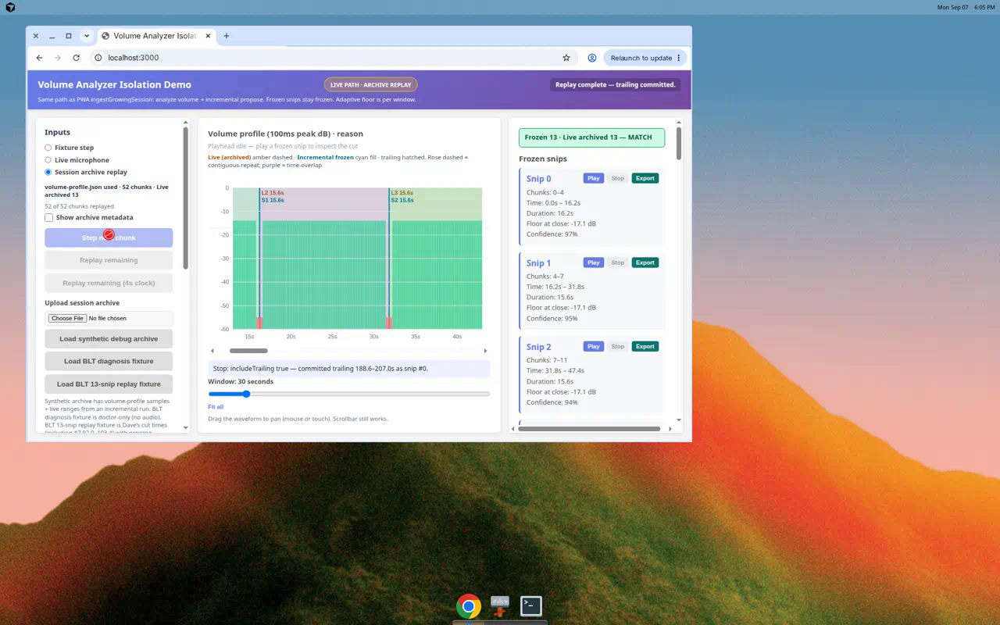
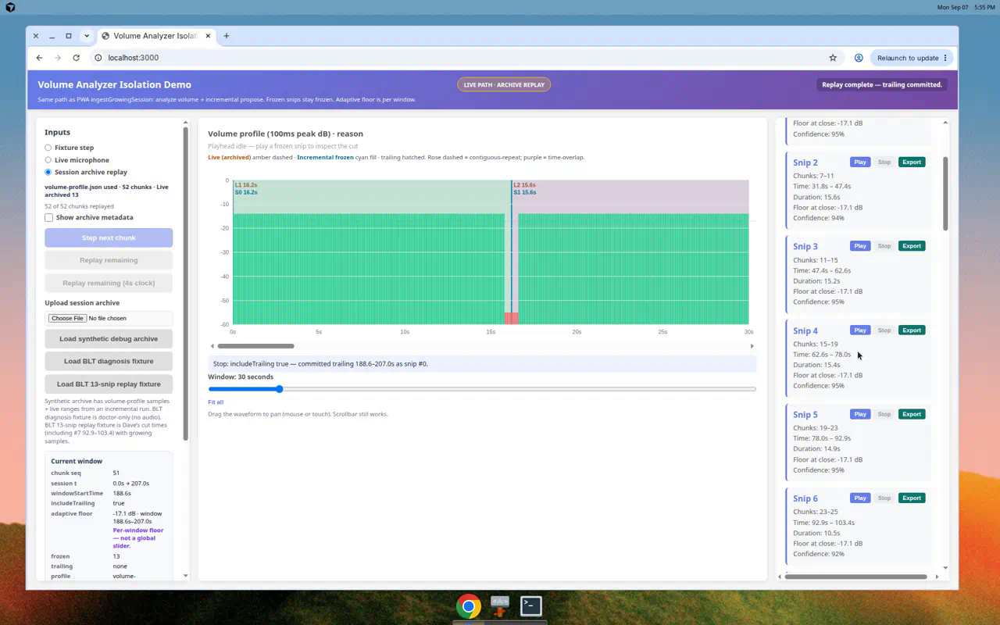
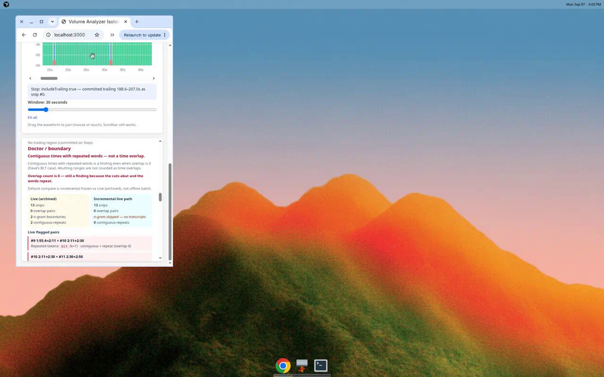
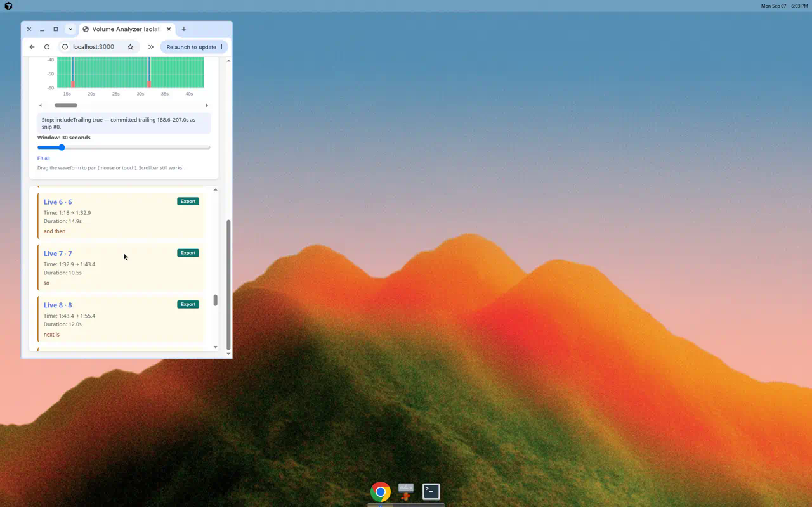

Spec Status: resolved
Spec Type: feedback
Created: 2026-09-07T17:35:00Z
Resolved: 2026-09-07T18:10:00Z
Product: packages/lib/volume-analyzer

# Feedback: Isolation Demo layout — metadata toggle, touch pan, snip export

## User Feedback

Dave browser-verified a real BLT session zip on the live-path Isolation Demo (PR #48). Diagnosis is possible, but the UI is unusable:

1. The waveform / middle panel is absurdly tall (“10 miles”). The **center column must not require page-tall scroll**. Left and right columns may scroll independently.
2. Upload / archive **manifest / chunk / profile / export dumps** consume huge vertical space. After upload, histogram + Frozen / Live / Doctor fall off screen.
3. Horizontal pan on the waveform works via scrollbar but **not touch-drag on iPhone**.
4. He needs **Export (download)** for an individual snip’s assembled audio so he can listen to Live #9 / #10 BLT edges himself (same assemble path as Play).

**Add-on (hard verify):** Dave reproduced the BLT debug zip on phone. Isolation Demo Frozen came out **12**, Live (archived) **13**. BLT shifted (Frozen 8/9 ≈ Live 9/10). Offline replay of `proposeSnipsIncremental` against `ses_1788550979475` volume-profile + manifest:

- Growing profiles per tick + final `includeTrailing: true` → **13 Frozen, exact range match to snips.json**
- Full stored profile on every tick while chunks grow → **11 wrong**
- After last tick with `includeTrailing` false only → **12 frozen + trailing**

Dave’s screenshot: Frozen Snip 7 = 103.4–115.4 (= Live #8). Live #7 (92.9–103.4 “so”) never froze; trailing became #12.

Do **not** claim an exact 13 match without a regression test and UI proof. Prior “delta 0” copy without this proof is rejected.

Doctor already reports **0 time overlaps + contiguous repeats** (cook, italian chicken, BLT, cheese quesadilla). Layout currently buries that.

This is a **diagnosis UI** fix only. Do **not** change snip cut math, `proposeSnipsFromProfile`, hangover, or ASR.

## Current behavior

Isolation Demo `isolation-demo/` after the live-path redesign:

- Three columns (Inputs | Histogram/reason | Outputs) but the page is a single growing document. The center histogram `flex: 1` **stretches to the tallest column**, so a long Frozen / Live / Doctor stack makes the canvas viewport-tall-plus.
- After zip parse, status / filename / current-window / inspector text stay fully expanded. There is no hide for archive metadata.
- Histogram pan is a **scrollbar only** (`histogram-hscroll`). Canvas click plays a snip. No pointer/touch drag pan; iPhone cannot scrub the window.
- Frozen / batch rows have Play / Pause / Stop. Live (archived) rows have no audio controls. No download.

LIVE PATH remains the default operating mode. Keep it.

## Requested Outcome

Isolation Demo UX only (`packages/lib/volume-analyzer/isolation-demo/**` + this spec + `isolation-demo/README.md` layout notes). One PR is OK.

### A. Layout

- Desktop: 3-column — Inputs | Histogram/reason | Outputs.
- **Center column**: fixed to the remaining viewport below chrome. It must **not** grow with left/right content and must **not** force the document to scroll for a mile-tall canvas.
- Histogram fills available **center** height with a **reasonable max** (~280–360px canvas). It does not grow with metadata.
- **Left / right columns**: independently scrollable when their content overflows.
- Avoid a single stacked document of metadata + tall canvas + outputs.

### B. Archive metadata

After zip upload, put manifest / chunk / profile / export details behind:

- checkbox **Show archive metadata** (default **off**), or a secondary tab/toggle.

When **off**, show only:

- a one-line status, e.g. `volume-profile.json used · 52 chunks · Live archived 13`
- Replay controls (`Step next chunk` / `Replay remaining` / 4s clock / Stop replay early)

When **on**, show the dump (formatVersion, exportedAt, session id/flags, chunk rows, profile mode, notes).

Default **hidden** after every new upload so histogram + Frozen / Live / Doctor stay on screen.

### C. Waveform pan

- Keep the seconds-window zoom slider + Fit all + scrollbar.
- Enable horizontal pan via **scrollbar and pointer/touch drag** on the histogram canvas (`touch-action` + pointer events).
- Dragging the canvas when zoomed pans `viewStart` in session seconds (same math as the scrollbar). A tap without a drag still plays a hit snip.
- Verify at iPhone width (~390px) or touch simulation.

### D. Snip audio export

On **Frozen**, **Live (archived)**, and **Offline batch** snip rows: an **Export** (or Download) button that:

- uses the same `assembleSnipWavBlob` path as Play
- downloads a WAV blob
- labels the file with snip index / time (e.g. `snip-9-115.0s-131.0s.wav`)

Especially useful for Live #9 and #10 around BLT. Disable when there is no playable audio (BLT doctor-only fixture).

### E. Archive replay must match live 13

- Extract the archive replay loop (`stepArchiveReplay` / `replayArchiveLivePath`). Grow **one stored chunk profile per tick**. Never pass the full zip profile while chunks are still growing.
- Last tick: `includeTrailing: true` (not “last tick false only”).
- Regression test: fixture from Dave’s archived ranges (including Live #7 92.9–103.4). Replay must yield **Frozen count === Live archived count === 13** and start/end within **50ms**. Fail the PR if not.
- Loud count compare on the outputs column: `Frozen N · Live archived M` with **FAIL** styling when N≠M. Never bury it.

## Notes For Phase 07

- Cursor Cloud Agent only — never Codex.
- Keep LIVE PATH default. Offline batch stays collapsed / labeled NOT live path.
- Do **not** change `proposeSnipsFromProfile` / `src/snips.ts` / defaults / hangover / ASR.
- Do **not** change PWA chrome.
- `make build` so `docs/isolation-demos/volume-analyzer/` publishes.
- Update this spec with a Resolution section when implementation ships.
- Do **not** mark this spec resolved from a specs-only commit.

## Out of scope

- Snip cut math / `proposeSnipsFromProfile` / hangover product fix
- PWA changes
- ASR / transcription
- playback-engine as a new dependency

## Resolution Criteria

Mark this spec resolved when:

- [x] Center column is viewport-capped; histogram canvas has a reasonable max (~280–360px) and does not grow with metadata
- [x] Left / right columns scroll independently
- [x] Archive metadata is hidden by default after upload; one-line status + replay controls remain
- [x] Histogram pans by scrollbar **and** pointer/touch drag
- [x] Frozen / Live archived / batch rows can Export assembled WAV (same path as Play)
- [x] Archive live-path replay of the BLT-shaped fixture yields Frozen === Live archived === 13 within 50ms
- [x] `Frozen N · Live archived M` is visible with FAIL styling when N≠M
- [x] `proposeSnipsFromProfile` / core snip algorithm unchanged
- [x] Isolation Demo README layout notes updated
- [x] `make build` published `docs/isolation-demos/volume-analyzer/`
- [x] Spec updated with a Resolution section (desktop + ~390px + Export proof)

## Resolution

**Resolved:** 2026-09-07  
**Package:** Isolation Demo only. `proposeSnipsFromProfile` / `src/snips.ts` / defaults unchanged.

### Replay match (the hard verify)

Dave’s phone 12-vs-13 was the Isolation Demo finishing the last chunk with `includeTrailing: false` (12 frozen + trailing). Offline check: growing profiles + last-tick `includeTrailing: true` matches live 13; full profile every tick is the 11-wrong path.

Shipped `archiveReplay.ts`: **one stored chunk profile per tick**, last tick `includeTrailing: true`. `Replay remaining` calls `replayArchiveLivePath`. Queue mapping also matches stored samples by chunkId **or** seq/index.

Regression `isolation-demo/src/archiveReplay.test.ts` + fixture `bltLiveReplayFixture.ts` (52 chunks, Dave’s cut times including Live #7 **92.9–103.4**):

- Growing + last `includeTrailing: true` → Frozen **13** = Live archived **13**, ranges within **50ms**
- Last tick false only → **12 frozen + trailing** (the phone-count failure mode)
- Profile length grows 1, then 2 — never the full zip mid-replay

Browser: **Load BLT 13-snip replay fixture** → **Replay remaining** → banner `Frozen 13 · Live archived 13 — MATCH`. Frozen snip 6 = 92.9–103.4s.

### Layout / metadata / pan / Export

- Center column viewport-capped; histogram max ~360px (desktop) / 280px (narrow)
- Left/right independently scrollable
- **Show archive metadata** default off; one-liner `volume-profile.json used · 52 chunks · Live archived 13`
- Canvas pointer/touch drag pan (`touch-action: none` when zoomed) + scrollbar
- **Export** on Frozen / Live archived / batch (same `assembleSnipWavBlob` WAV)

Loud banner: `Frozen N · Live archived M` — FAIL rose when N≠M, MATCH green when equal.

`make build` publishes `docs/isolation-demos/volume-analyzer/`.

