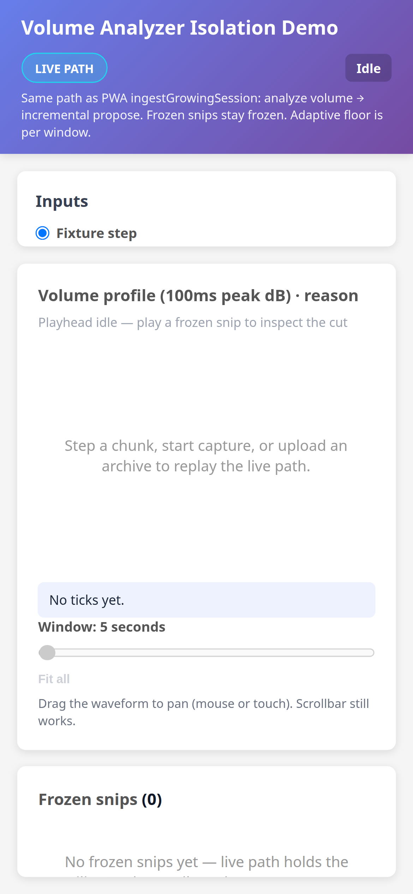
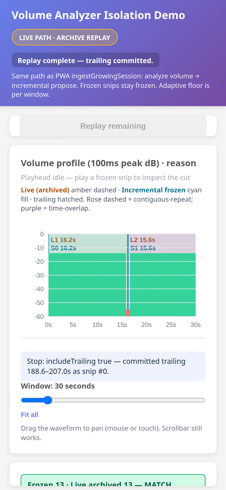
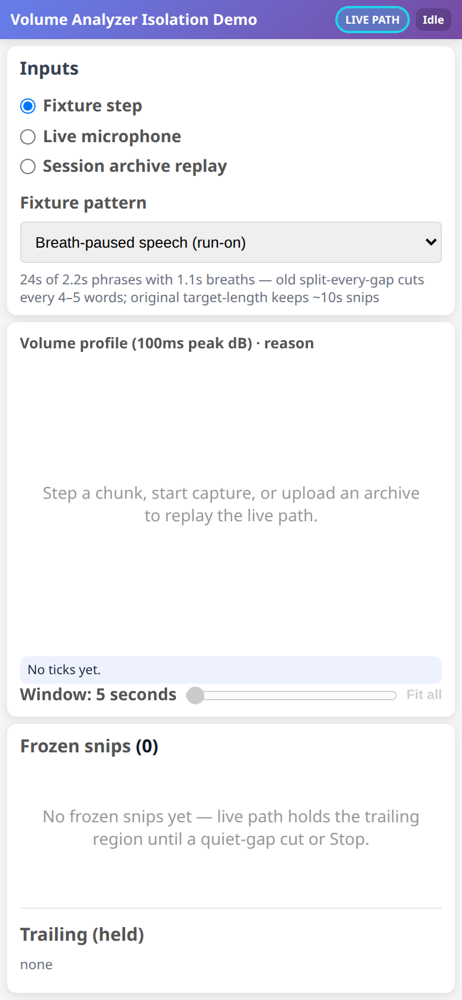
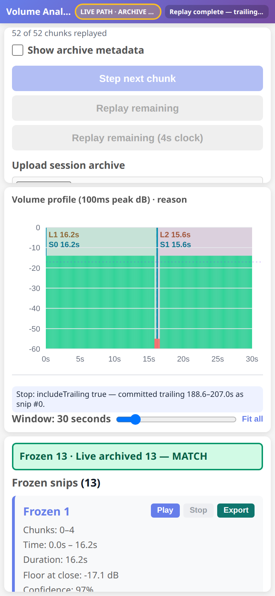

Spec Status: resolved
Spec Type: feedback
Created: 2026-09-08T14:39:00Z
Resolved: 2026-09-08T15:20:00Z
Product: packages/lib/volume-analyzer

# Feedback: Isolation Demo mobile factory floor — zoom panels out ~50%

## User Feedback

Dave likes the improved iPhone Isolation Demo (viewport-locked, no mile-tall histogram, metadata checkbox default off, touch-drag pan, MATCH banner). The three stacked panels (upper Inputs / middle Histogram / bottom Outputs) are **too tiny** to diagnose on ~390px.

Zoom the mobile factory floor out by about **50%** so the three panels are ~**2× more usable** — readable Inputs / Histogram / Outputs on iPhone. Do this by reducing leftover compact-zoom / chrome waste and giving each panel a larger share of the viewport. Scale the UI so controls and the waveform are readable.

**Keep:**

- Viewport-locked document (`100dvh`, no page-tall scroll)
- Histogram **not** mile-tall — 280px desktop / 220px narrow caps stay sensible; the canvas may grow modestly for readability
- **Show archive metadata** checkbox default **off**
- Histogram **touch-drag pan**
- Loud `Frozen N · Live archived M — MATCH` banner

This is a **diagnosis UI scale** fix only. Do **not** change snip cut math, `proposeSnipsFromProfile`, hangover, or ASR.

## Current behavior

After the layout / metadata / touch-pan PR, iPhone (~390) stacks the factory floor:

- `html { zoom: 0.5 }` from `compact-mobile.css` is already overridden (`zoom: 1`). Keep that — do not bring 50% compact-zoom back.
- Top chrome (title + wrapping chips + three-line subline) plus `1rem` gaps/padding consume a large slice of `100dvh`.
- Inputs is capped at **26vh**, so only one or two controls are visible at a time.
- Histogram canvas is a fixed **220px** box, but heading / idle playhead / overlay legend / reason / zoom hint make the **middle card** dominate the viewport.
- Outputs gets the leftover sliver (often just the MATCH banner peeking in).

Idle and post-replay at iPhone 12 Pro (390×844) before this change:

## Requested Outcome

Isolation Demo UX only (`packages/lib/volume-analyzer/isolation-demo/**` + this spec + `isolation-demo/README.md` layout notes). One PR is OK.

### Mobile factory floor (~390, stacked)

- Keep **upper / middle / bottom** stacked panels (do not return to a shrunken 3-column `zoom: 0.5` desktop).
- Reclaim chrome: compact the header on narrow viewports (subline can hide; chips stay).
- Cut main padding/gaps roughly in half so panels own the viewport.
- **Inputs** and **Outputs** share the leftover height equally (no 26vh Inputs cap). Each pane still scrolls internally.
- **Histogram** stays a capped box. 280 desktop / 220 narrow remain the contract; mobile canvas may grow modestly (about 240–250px) if that helps readability. Never `height: auto` / flex-grow the canvas.
- Make on-screen controls readable (source radios, Step / Replay, window slider) without unlocking the document.

### Must not regress

- Document stays `100dvh` / `overflow: hidden` on iPhone
- Metadata checkbox default off; one-line archive status
- Canvas pointer/touch drag pan when zoomed
- MATCH / FAIL count banner still in Outputs
- Desktop 3-column factory floor unchanged in spirit (280px center cap)

## Notes For Phase 07

- Cursor Cloud Agent only — never Codex. Model grok-4.6 only.
- Keep LIVE PATH default. Offline batch stays collapsed / labeled NOT live path.
- Do **not** change `proposeSnipsFromProfile` / `src/snips.ts` / defaults / hangover / ASR.
- Do **not** change PWA chrome or transcription demo.
- `make build` so `docs/isolation-demos/volume-analyzer/` publishes.
- Update this spec with a Resolution section when implementation ships.

## Out of scope

- Snip cut math / `proposeSnipsFromProfile` / hangover product fix
- PWA import visibility / PWA chrome
- Transcription Isolation Demo
- playback-engine as a new dependency

## Resolution Criteria

Mark this spec resolved when:

- [x] iPhone ~390 stacked panels are ~2× more usable than the 26vh / leftover split (Inputs and Outputs each take a real share; histogram still capped)
- [x] Document remains viewport-locked; histogram is not mile-tall
- [x] Metadata checkbox default off; touch-drag pan; MATCH banner kept
- [x] Isolation Demo README layout notes updated
- [x] `make build` published `docs/isolation-demos/volume-analyzer/`
- [x] Spec updated with a Resolution section (iPhone ~390 before/after-style proof)

## Resolution

**Resolved:** 2026-09-08  
**Package:** Isolation Demo CSS / README only. `proposeSnipsFromProfile` / `src/snips.ts` / defaults unchanged.

On iPhone (~390×844, `100dvh` locked, `zoom: 1` — compact-mobile `zoom: 0.5` still overridden):

- Header is one nowrap row (~33px). Chrome subline is hidden. Chips ellipsis instead of wrapping after replay.
- Main padding/gaps cut to `0.4rem`. Idle playhead + overlay legend + pan hint hide so the middle card is mostly waveform.
- Inputs / Outputs are `1.2fr` / `1.2fr` (no 26vh cap). Idle: **226px** each. After BLT replay: **219px** each.
- Histogram canvas **250px** narrow (desktop stays **280px**). Panel stays `auto` around that cap — never flex-grows. `document.scrollHeight === 844` (full-page screenshot is the same 390×844 box).
- **Show archive metadata** stays unchecked after Load BLT 13-snip replay fixture.
- Loud banner `Frozen 13 · Live archived 13 — MATCH` sits at the top of Outputs.

Usable content vs the cramped before shots: Inputs shows three source radios + fixture pattern (was one radio); Outputs shows MATCH + Frozen 1 (was a sliver); histogram is modestly taller and still capped.

`make build` publishes `docs/isolation-demos/volume-analyzer/`.
